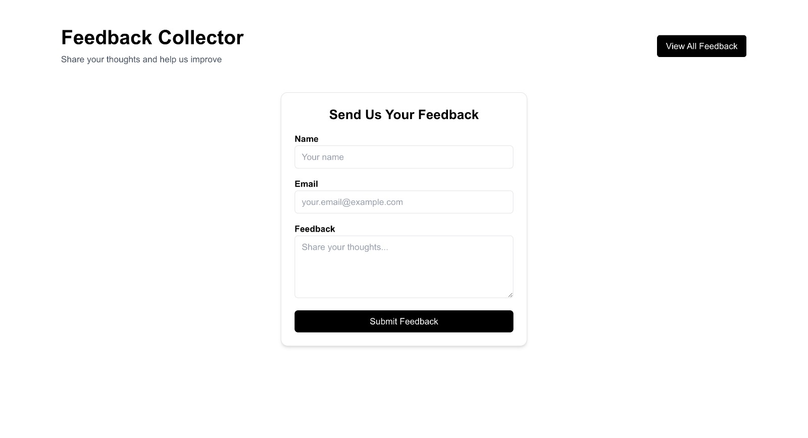
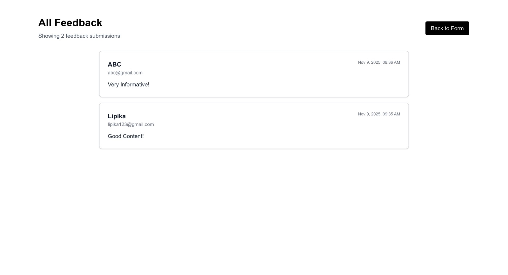

# 📝 Feedback Collector

A simple feedback collection app built using **Next.js, MongoDB Atlas, Prisma ORM, and Tailwind CSS**.
It allows users to submit their name, email, and feedback — all stored in a MongoDB database and viewable via a server-rendered page.


## Preview

👉 [Experiment it Live!](https://feedback-form-101.vercel.app/)
## Screenshots

### Landing Page


### View Feedbacks Page


## Usage
- Open the homepage `(/)` to submit your feedback.

- Navigate to `/feedbacks` to view all submitted feedback entries.
  
## Core Features

- **Feedback Form** – Submit your name, email, and feedback.

- **Data Storage** – Feedback is securely stored in MongoDB Atlas via Prisma ORM.

- **Server-Rendered Feedback Page** – View all feedback entries at **/feedbacks** route.

- **App Router Integration** – Built with Next.js App Router for modern routing and layout management.

- **Client Component** – Interactive form using a client-side component for real-time input handling.

- **Styled with Tailwind CSS** – Clean, responsive, and minimal design.

## Tech Stack

- **Framework**: [Next.js](https://nextjs.org/)  
- **Language**: TypeScript  
- **Styling**: Tailwind CSS
- **Database**: MongoDB Atlas
- **ORM**: Prisma ORM


## Installation Guide

### ✅ Prerequisites

Before you begin, make sure you have:

- **Node.js** (v20 or later) – [Download](https://nodejs.org/)
- **npm** or **yarn**
- **MongoDB Atlas Account** - [Create Account](https://www.mongodb.com/cloud/atlas/register)

### Clone the Repository

```bash
git clone https://github.com/lipika1911/feedback_form.git
cd feedback-form
```

### Install Dependencies

```bash
npm install
```

### Configure Environment Variables
Create a `.env` file in the root directory based on `.env.example` :

```bash
DATABASE_URL="mongodb+srv://<USERNAME>:<PASSWORD>@cluster0.mongodb.net/<DATABASE>?retryWrites=true&w=majority"
```

### Setup Prisma
Generate the Prisma client and push the schema to your database:

```bash
npx prisma generate
npx prisma db push
```

### Run the App

```bash
npm run dev
```

### ✅ You’re all set!
- Open http://localhost:3000 in your browser.
